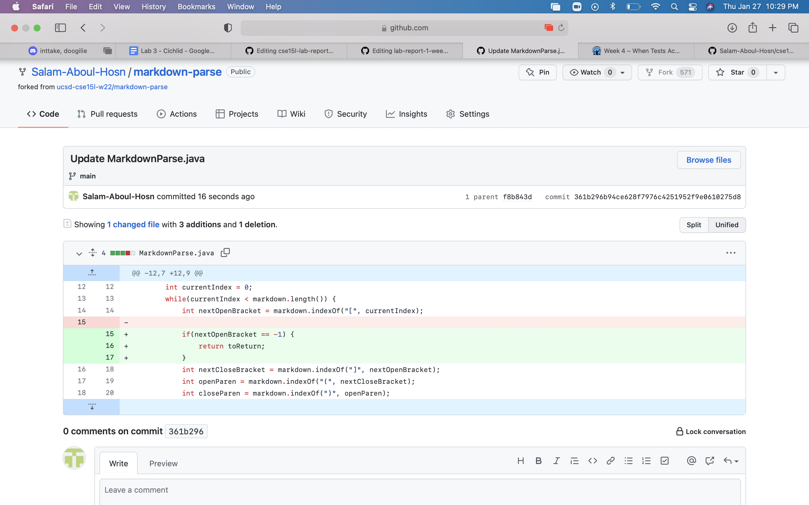
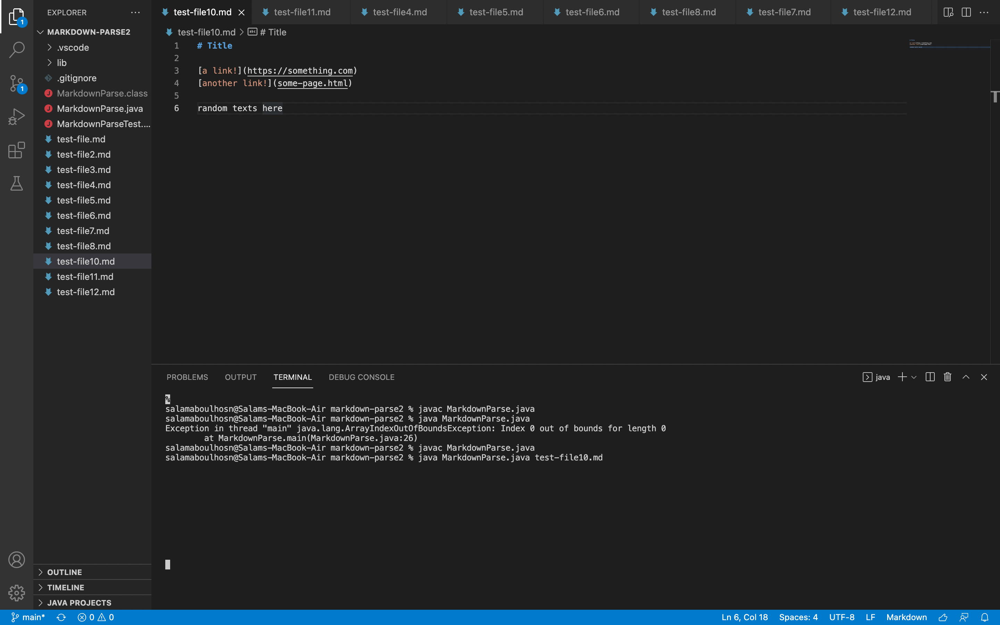
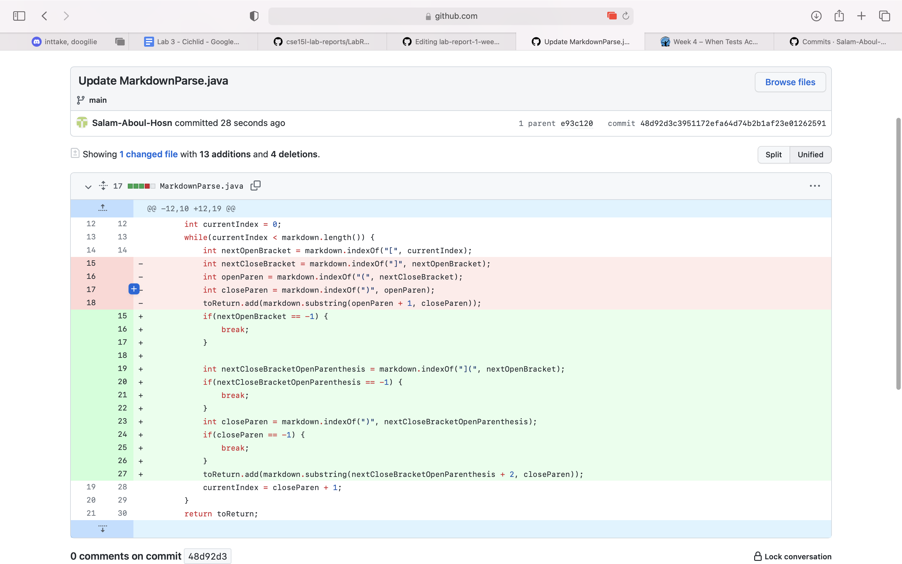
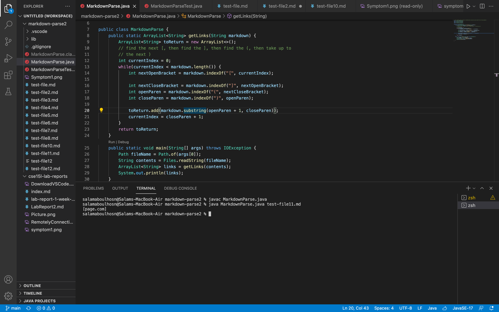
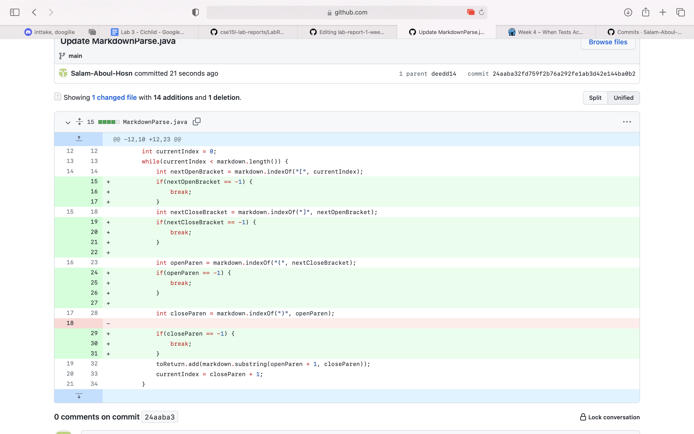
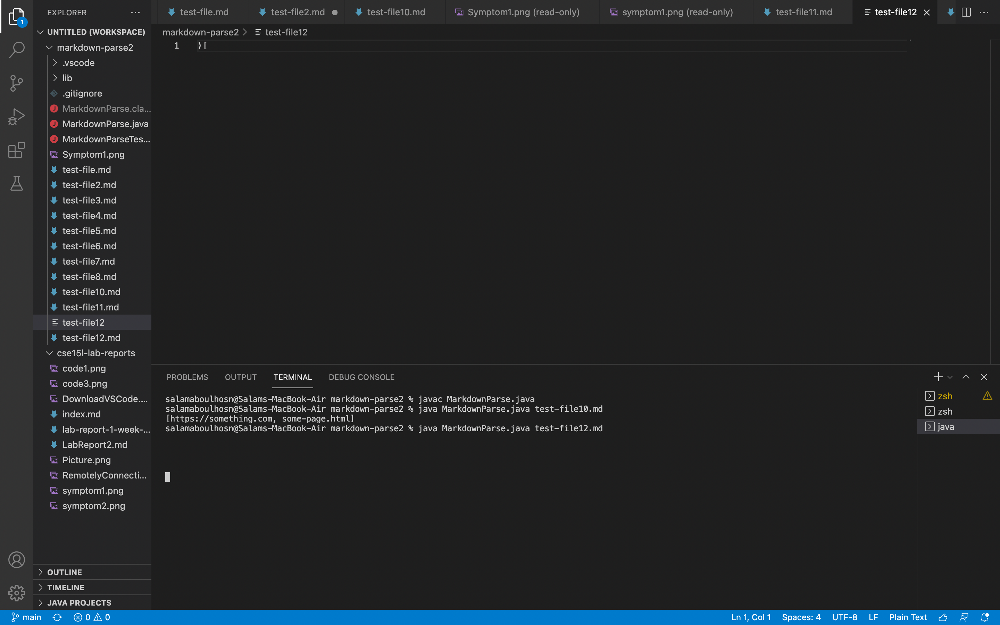

# Code Change 1 
**Screenshot of code changes**
 \
**Linked to the test file** \
[LinkToTheTestFile1](https://github.com/Salam-Aboul-Hosn/markdown-parse/commit/fe48eaa3de504613f4dc99fb3419e9c293c6fec0) \
**Picture of the symptom** 

**Description** \
The symptom/code behavior that occured in this section is that an infinite loop occured. I fixed this by returning something if nextOpenBracket was equal to -1 because if it equaled -1 then there was no nextOpenBracket and it would jump out of the loop.

# Code Change 2
**Screenshot of code changes**
 \
**Linked to the test file** \
[LinkToTheTestFile2](https://github.com/Salam-Aboul-Hosn/markdown-parse/commit/68ef65cd56ee8afb30c0542444c3e2de58c67895) \
**Picture of the symptom** 

**Description** \
The symptom/code behavior that occured in this section is that the link wasn't print out entirely. Although it ran properly it did not print out the full output that it was intended to print out. I fixed this bug by combining the closed bracket and the open paranthesis so that it would print the entire output.

# Code Change 3
**Screenshot of code changes**
 \
**Linked to the test file** \
[LinkToTheTestFile3](https://github.com/Salam-Aboul-Hosn/markdown-parse/commit/a06a975192b0d64625d74f976d0c3c3ec2418fc4) \
**Picture of the symptom** 

**Description** \
The symptom/code behavior that occured in this section is that an infinite loop occured. So I added break statements in order to break out of the loop when neccessary.
