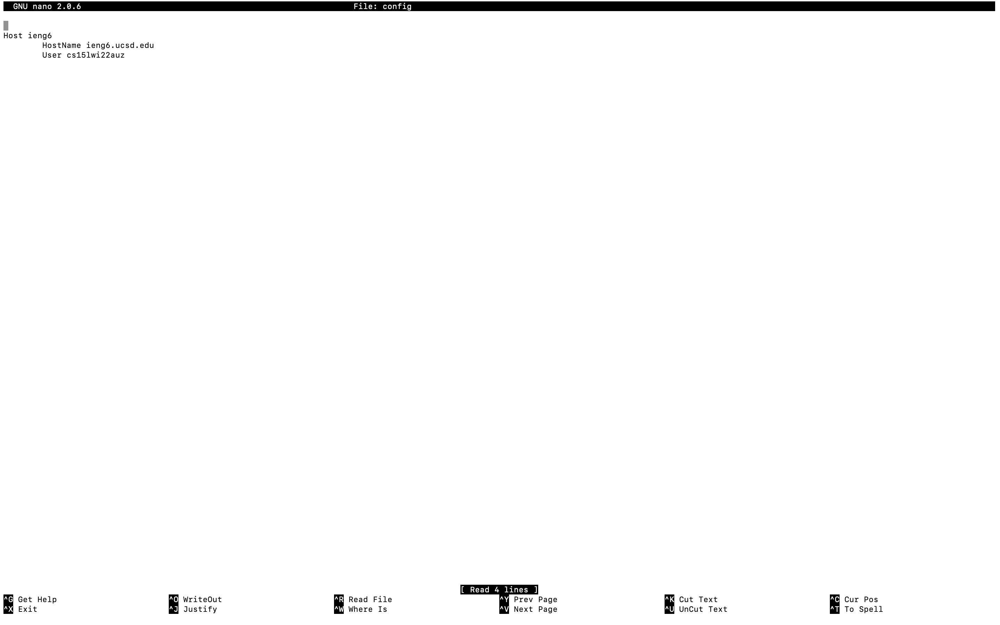
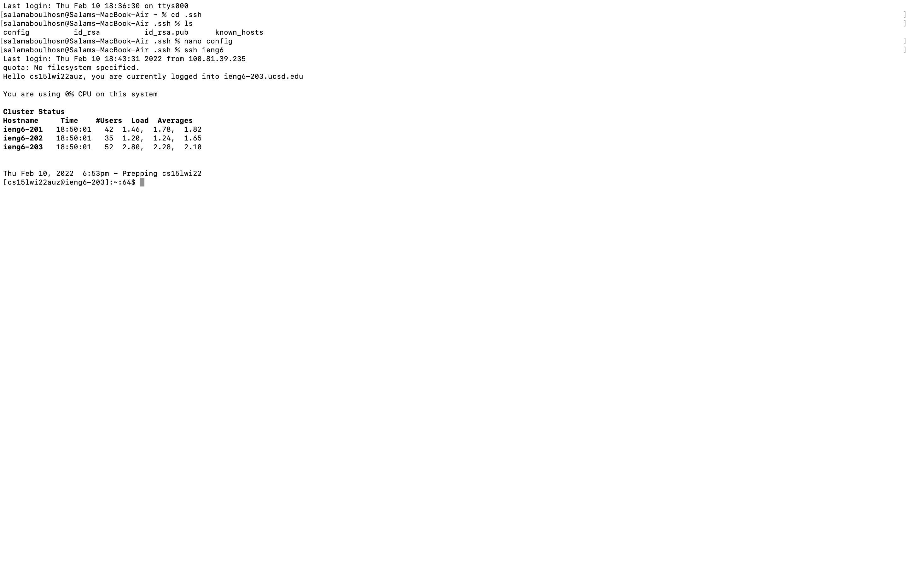
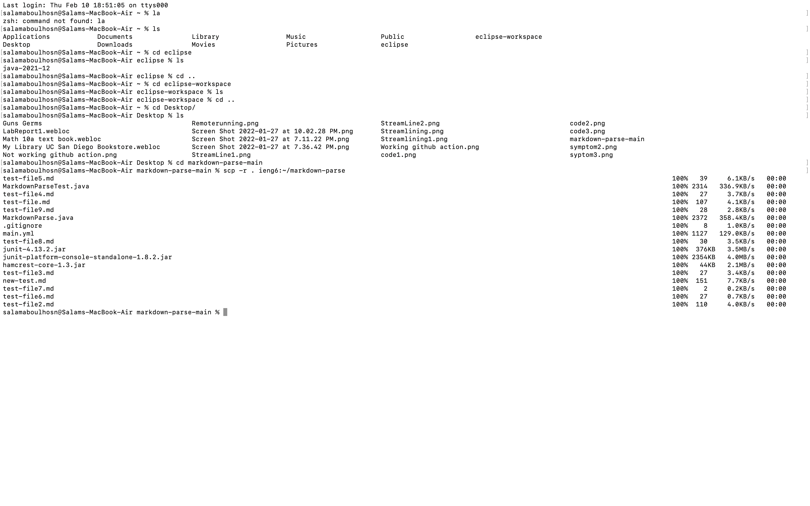

# Editing file
 \
**Description** \
This is a screeen shot of me editing my config file with the 'nano' text editor. 'nano' is a text editor for mac. This `~/.ssh/config` command tells SSH what username to use when logging into specific servers. This makes a new login so that it is faster and easier to type.
# Command logging you into my account
 \
**Description** \
This is screen shot of me logging into my account. Instead of having to type in my entire account name all I had to do now was 'ssh ieng6'.
# Command copying a file to my account
 \
**Description** \
The `scp -r` command copies over a file and is a way to securely transfer files between a local and a remote host. We used this command in order to copy a directory and all the files and directories within it recursively. Which copies the entire markdown-parse directory with one single command.
