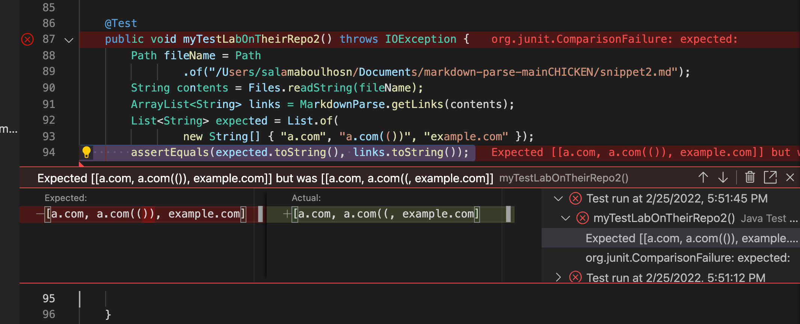

# Lab Report 4
## Link To My Markdown Parse
[LinkToMyMarkDownParse](https://github.com/Salam-Aboul-Hosn/cse15l-lab-reports/tree/main/markdown-parse-main) 

## Link To The Markdown Parse I reviewed
[LinkToTheMarkDownParseIReviewed](https://github.com/aajc/markdown-parse)

## Test Method 1 On Their Repo
 
**Failed Test Description** 
- Test failed and only accounted for the link with the backtick and not the other

## Test Method 2 On Their Repo
 
**Failed Test Description** 
- Test failed and made a mistake with the paranthesis

## Test Method 3 On Their Repo 
 
**Failed Test Description** 
- Test failed and is an infinite loop

# How can I Make my Program Work?
## Code Snippet 1
 \
**Description on how to fix it** 
- The code output included url.com as a link but it is not a link. 
- I would be able to fix this in less than ten lines 
- I would need to stop looking for open brackets if I am inside a code block.

## Code Snippet 2
 \
**Description on how to fix it** 
- I failed to account for the links that contain extra parentheses and brackets. 
- It would probably take more than ten lines to fix this problem and account for extra brackets and parentheses that are not part of the link formatting along with all the other escape characters.

## Code Snippet 3
 \
**Description on how to fix it** 
- For this snippet, all of the links contained new lines in them, and my program didn't recognize any of them. 
- I could probably take ten lines or less to ignore white space and account for the links.
- I could ingnore white spaces by changing the regular expression to account of the spaces

