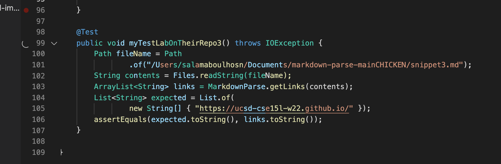

# Lab Report 4
## Link To My Markdown Parse
[LinkToMyMarkDownParse](https://github.com/Salam-Aboul-Hosn/cse15l-lab-reports/tree/main/markdown-parse-main) 

## Link To The Markdown Parse I reviewed
[LinkToTheMarkDownParseIReviewed](https://github.com/aajc/markdown-parse)

## Test Method 1 On Their Repo
 
**Failed Test Description** \
- Test failed and only accounted for the link with the backtick and not the other

## Test Method 2 On Their Repo
 
**Failed Test Description** \
- Test failed and made a mistake with the paranthesis

## Test Method 3 On Their Repo 
 
**Failed Test Description** \
- Test failed and is an infinite loop

# How can I Make my Program Work?
## Code Snippet 1
 \
**Description on how to fix it** \

## Code Snippet 2
 \
**Description on how to fix it** \

## Code Snippet 3
 \
**Description on how to fix it** \
