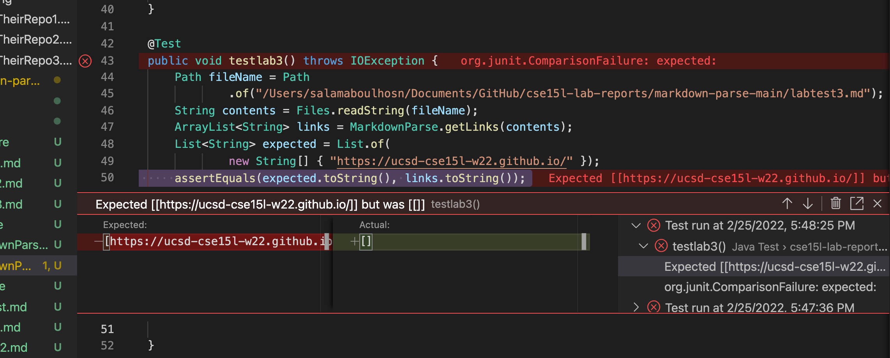

# Lab Report 4
## Link To My Markdown Parse
[LinkToMyMarkDownParse](https://github.com/Salam-Aboul-Hosn/cse15l-lab-reports/tree/main/markdown-parse-main) 

## Link To The Markdown Parse I reviewed
[LinkToTheMarkDownParseIReviewed](https://github.com/aajc/markdown-parse)

## Test Method 1 On Their Repo
 

## Test Method 2 On Their Repo
 

## Test Method 3 On Their Repo
 

## Code Snippet 1
 \
**Description on how to fix it** \

## Code Snippet 2
 \
**Description on how to fix it** \

## Code Snippet 3
 \
**Description on how to fix it** \
