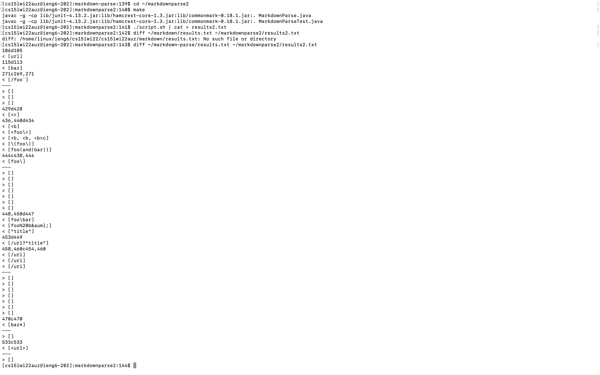
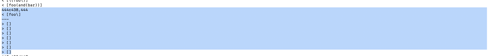

# Lab Report 5
## Using diff to find test results
 
**Description on how I found the tests** 
- First I started off by logging into ieng6 and cloning my markdown parse and cloning Joes markdown parse
- I ran multiple commands such as make, chmod +x script.sh, and ./script.sh | cat > results.txt
- After than I ran the diff command in order to get the different test results

## Test Method 470
### Different outputs
 
**Description** 
- Test failed and made a mistake with the paranthesis

## Test Method 533
### Different outputs
 
**Test Description** 
- Test failed and is an infinite loop
