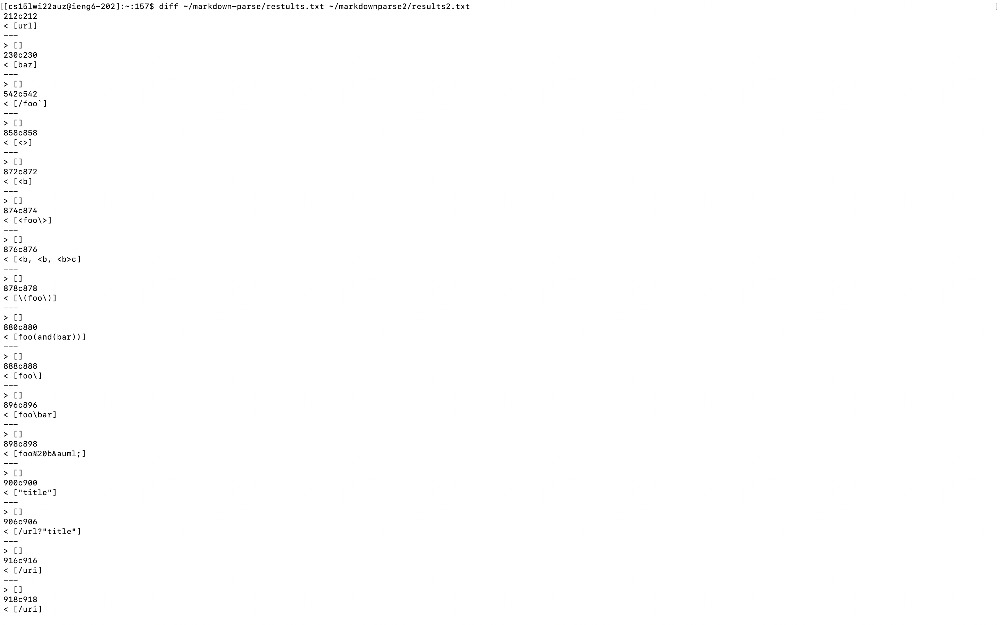
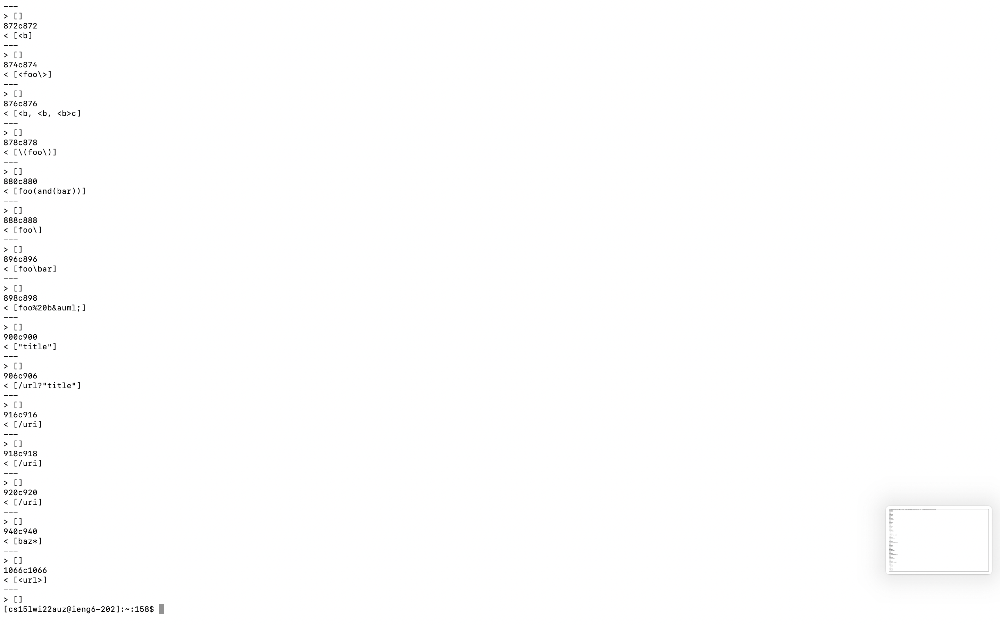
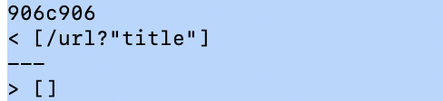
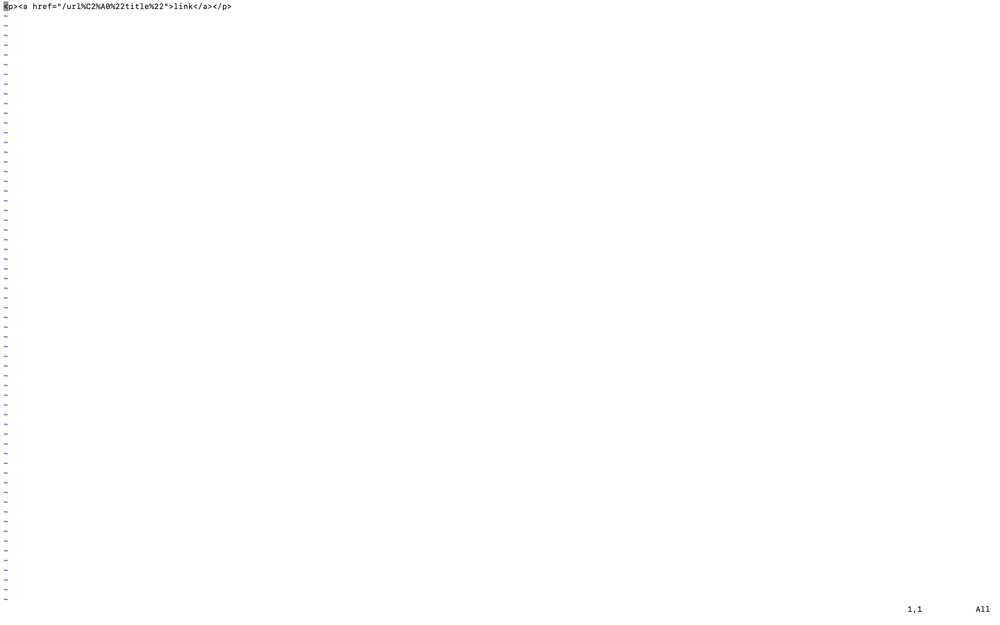
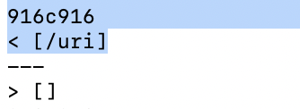
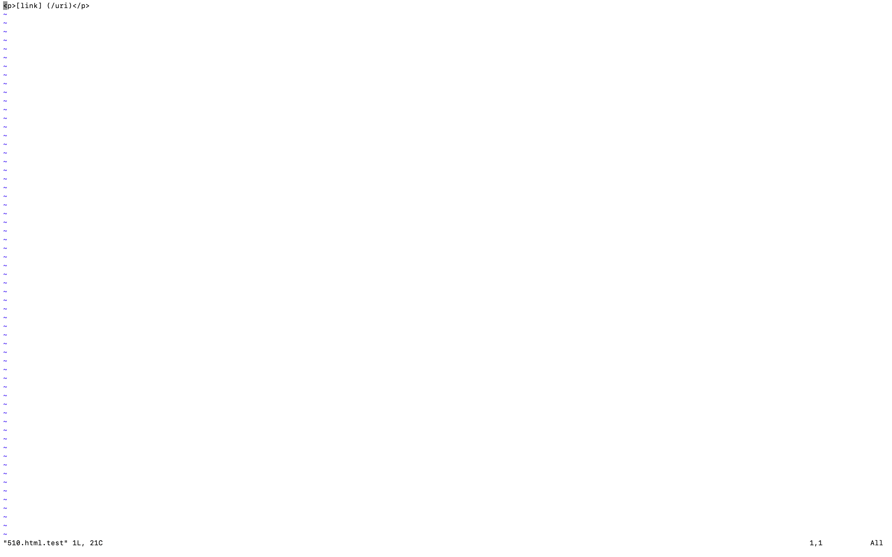
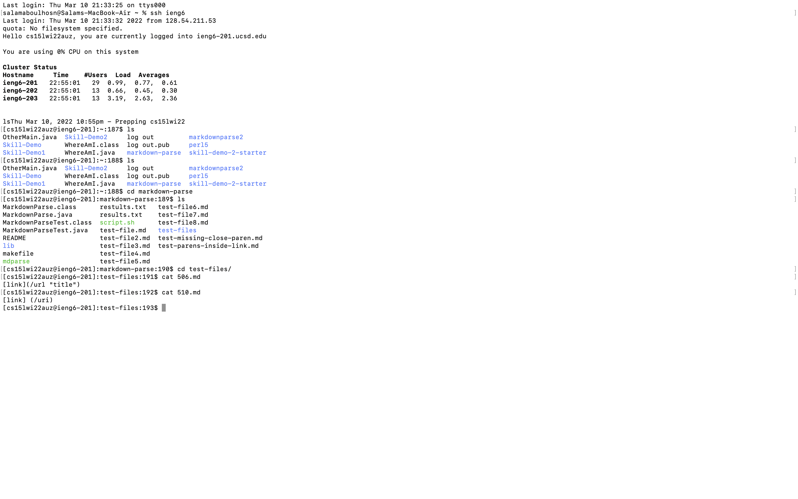
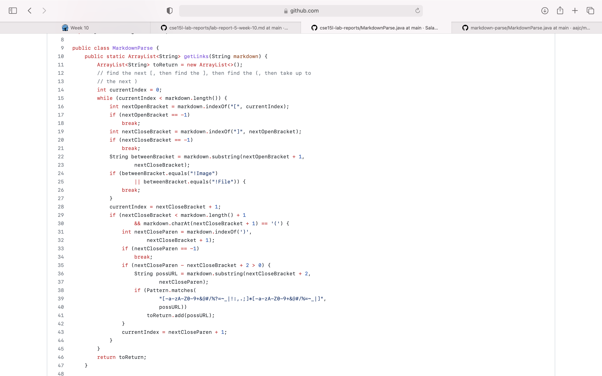

# Lab Report 5
## Using diff to find test results
 
 
**Description on how I found the tests** 
- First I started off by logging into ieng6 and cloning my markdown parse and cloning Joes markdown parse
- I ran multiple commands such as `make`, `chmod +x script.sh`, and `./script.sh | cat > results.txt`
- After than I ran the diff command in order to get the different test results

## Test File 506
### Different outputs
 
### Expected output
 
**Description** 
- As you can see the expected output is a url. Thus signifying that the output with the url at the top is the correct one. Which is Joes markdownparse

## Test File 510
### Different outputs
 
### Expected output
 
**Description** 
- As you can see the expected output is empty. Thus signifying that the output with the empty bracket is the correct one. Which is my markdownparse

## Contents of test file 506 and 510
 
### Fixing my code for test file 506
 
This image shows my repository due to the fact that the expected output was different than my output for the test file 506. In order to fix my code and make sure that the actual output matches the expected output (Which is making sure that my code outputs a link rather than empty brackets) I could

### Fixing Joes code for test file 510
 
This image shows their repository due to the fact that the expected output was different than their output for the test file 510. In order to fix Joes code and make sure that the actual output matches the expected output (Which is making sure that their code outputs a emtpy brackets rather than a link) I could

