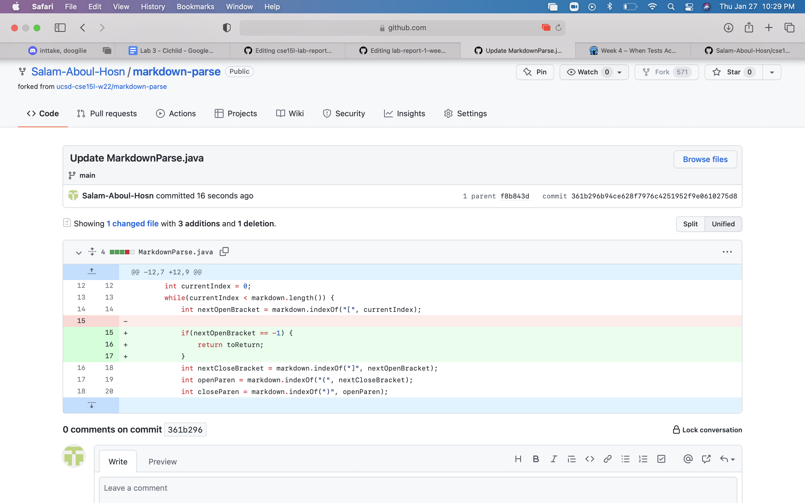
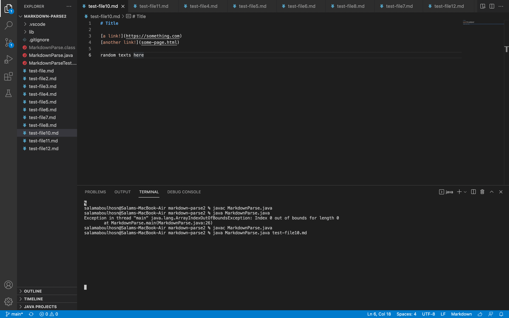
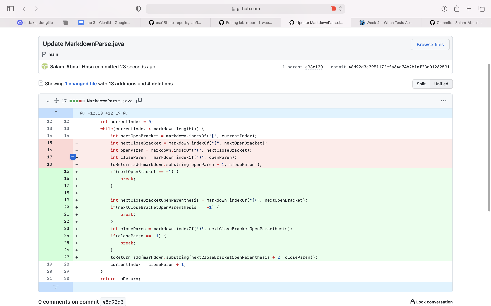
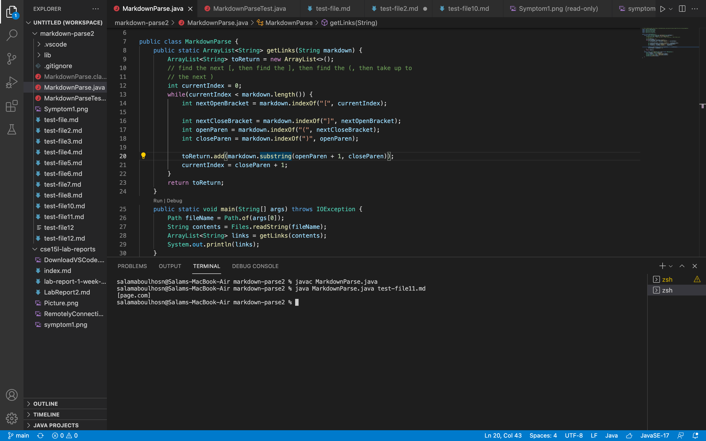
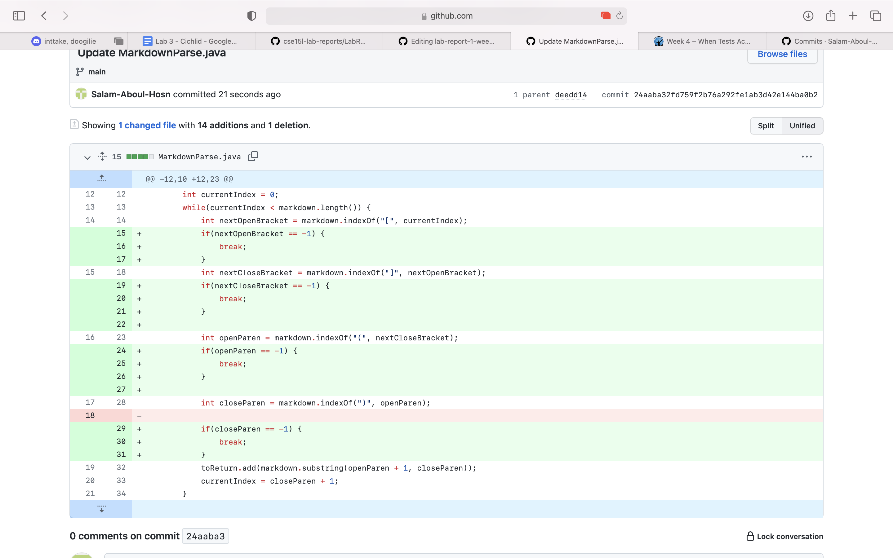
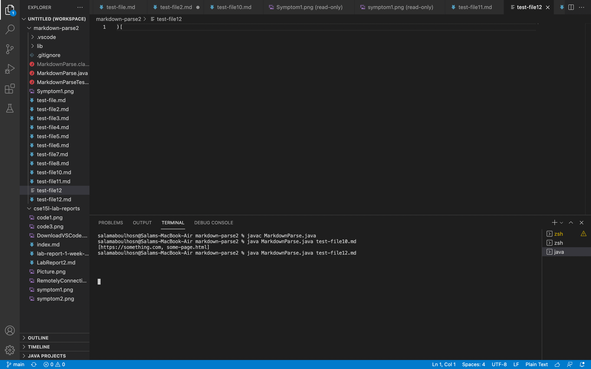

# Code Change 1 
**Screenshot of code changes**
 \
**Linked to the test file** \
[LinkToTheTestFile1](https://github.com/Salam-Aboul-Hosn/markdown-parse/commit/fe48eaa3de504613f4dc99fb3419e9c293c6fec0) \
**Picture of the symptom** 

**Description** \
The symptom/code behavior that occured in this section is that an infinite loop occured. I fixed this by returning something if 

# Code Change 2
**Screenshot of code changes**
 \
**Linked to the test file** \
[LinkToTheTestFile2](https://github.com/Salam-Aboul-Hosn/markdown-parse/commit/68ef65cd56ee8afb30c0542444c3e2de58c67895) \
**Picture of the symptom** 

**Description** \
The symptom/code behavior that occured in this section is that the link wasn't print out entirely.

# Code Change 3
**Screenshot of code changes**
 \
**Linked to the test file** \
[LinkToTheTestFile3](https://github.com/Salam-Aboul-Hosn/markdown-parse/commit/a06a975192b0d64625d74f976d0c3c3ec2418fc4) \
**Picture of the symptom** 

**Description** \
The symptom/code behavior that occured in this section is that an infinite loop occured. 
